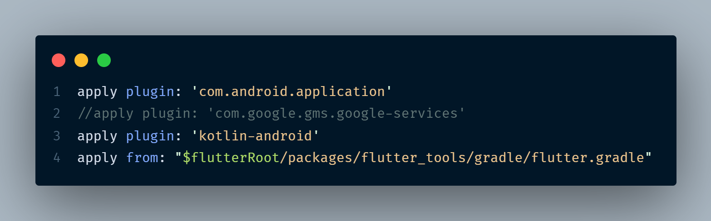
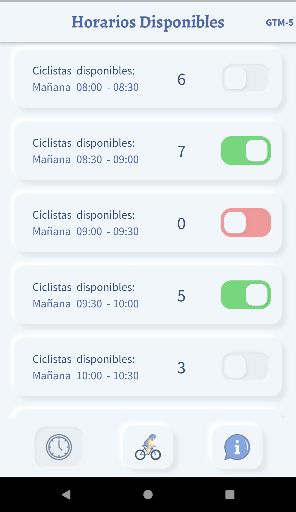

# App renta de ciclista

Proyecto de portafolio sobre un mini sistema de renta

## Comenzando 🚀

_Estas instrucciones te permitirán obtener una copia del proyecto en funcionamiento en tu máquina local para propósitos de desarrollo y pruebas._

### Pre-requisitos 📋

#### Tener instalado Flutter

### Instalación 🔧

### instalar dependencias

```
flutter pub get
```

## Ejecutando App ⚙️

### Ejecutar con datos mock (no es necesario integrarlo con Firebase)

```
flutter run --debug --flavor tst -t lib/main_demo.dart
```

#### para su version realase con datos mock

```
flutter run --realase --flavor tst -t lib/main_demo.dart
```

### Para los servicios con Firebase descomentar linea en 'android\app\build.gradle' y configurar los google-services.json en los folders 'android\app\src\dev' , 'android\app\src\prod' y 'android\app\src\tst'



### Ejecutar en modo desarrollo Local (necesario configurar emulador de firestore y su puerto en main_dev_local.dart)

```
flutter run --debug --flavor dev -t lib/main_dev_local.dart
```

### Ejecutar en modo produccion

```
flutter run --realase --flavor prod -t lib/main_prod.dart
```

## Build 📦

### Crear el apk

```
flutter build apk --flavor prod -t lib/main_prod.dart
```

## Construido con 🛠️

- [Redux](http://www.dropwizard.io/1.0.2/docs/) - El manejador de estados usado
- [pub](https://maven.apache.org/) - Manejador de dependencias
- [Firebase](https://firebase.google.com/) - Usado como base de datos y authenticacion

## Wiki 📖




## Versionado 📌

Para todas las versiones disponibles, mira los [tags en este repositorio](https://github.com/tu/proyecto/tags).

## Autores ✒️

- **Jair Conislla** - [@fardcrex](https://twitter.com/fardcrex)

También puedes mirar la lista de todos los [contribuyentes](https://github.com/fardcrex/app-rent-bike/tags) quíenes han participado en este proyecto.

## Expresiones de Gratitud 🎁

---
